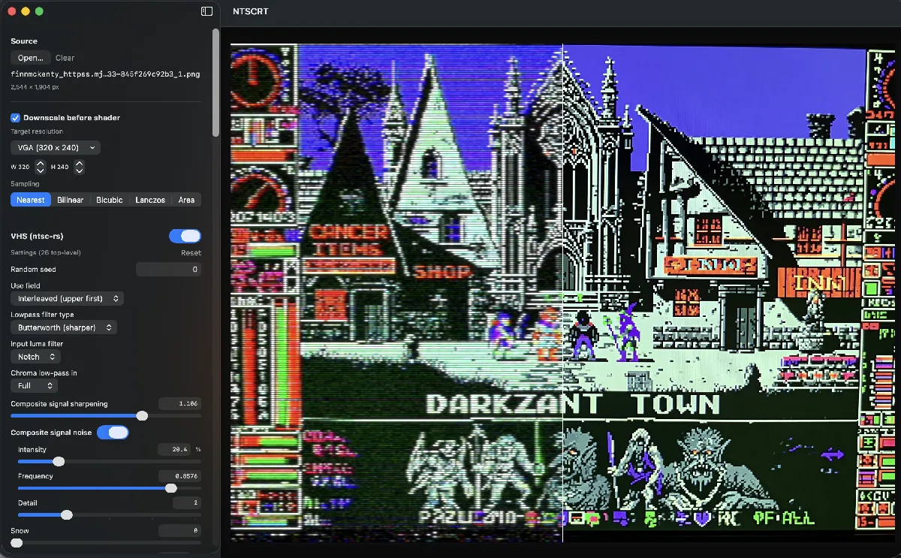

# NTSCRT



A native macOS app for recreating vintage analog TV and VHS images: [ntsc-rs](https://github.com/ntsc-rs/ntsc-rs) emulates the analog signal path (composite artifacts, tape noise, head switching), and RetroArch's CRT shaders — run through [librashader](https://github.com/SnowflakePowered/librashader), so output matches RetroArch frame-for-frame — draw the display. Pipeline: **NTSC (full res) → downscale → CRT shader**, on stills or video, with a normal mouse/keyboard UI.

To be clear about what this is: **I basically hacked two much better projects together.** All of the actual image magic is ntsc-rs and the RetroArch shader ecosystem; this repo is the SwiftUI/Metal glue between them.

## Credits

- [ntsc-rs](https://github.com/ntsc-rs/ntsc-rs) — the NTSC/VHS signal emulation (MIT/ISC/Apache-2.0). The VHS panel is generated from its own settings schema, and its preset JSON works in both apps.
- [librashader](https://github.com/SnowflakePowered/librashader) by SnowflakePowered — the RetroArch-compatible shader runtime (MPL-2.0).
- [libretro/slang-shaders](https://github.com/libretro/slang-shaders) and the RetroArch community — the CRT shader presets themselves (crt-royale by TroggleMonkey, crt-easymode/crt-aperture by EasyMode, crt-hyllian by Hyllian, crtsim, crtglow — various licenses, largely GPL).

Status:
- **Phase 1** — librashader bridge: working, all 6 shaders verified.
- **Phase 1+** — downscale pre-pass: working, all 5 sampling methods verified.
- **Phase 2** — SwiftUI app shell with sidebar (source / downscale / shader / export panels) and live MTKView preview: builds and launches. Visual verification of the window UI is pending (waiting on full Xcode for proper iteration).
- **Phase 3** — video pipeline: not yet built.

## Layout

```
Sources/
  CrtAppBridge/    Objective-C wrapper around librashader's Metal C API
  CrtCore/         Shared Swift: Downscaler, Pipeline, ImageIO, presets list
  CrtSmoke/        CLI verifier: input image → optional downscale → shader → PNG
  CrtApp/          SwiftUI app: sidebar UI + MTKView preview + PNG export
Vendor/
  librashader/     librashader.dylib + headers (built locally; not in git)
  slang-shaders/   submodule of libretro/slang-shaders (preset .slangp files)
```

## Prerequisites

- macOS 14+ on Apple Silicon
- Xcode Command Line Tools (`xcode-select --install`) — enough for the CLI
- Full Xcode (App Store) — only for `swift test` (XCTest) and universal `--arch` builds; the app itself builds with the CLT
- Rust toolchain (`brew install rust`) — to build librashader from source

## Build

```sh
git submodule update --init --recursive

# Build librashader once (universal). The `stable` feature lets it compile on
# stable Rust. Homebrew's rust is host-only; install rustup for the x86_64
# target: brew install rustup && rustup toolchain install stable &&
#         rustup target add --toolchain stable x86_64-apple-darwin
# PINNED to 76462c03: newer librashader changes crt-royale rendering
# (verified ~8/255 mean pixel change). Re-run the crt-smoke byte-compare
# against current renders before ever bumping this.
git clone https://github.com/SnowflakePowered/librashader.git /tmp/librashader-src
git -C /tmp/librashader-src checkout 76462c03
TC="$HOME/.rustup/toolchains/stable-aarch64-apple-darwin"
(cd /tmp/librashader-src && RUSTC="$TC/bin/rustc" "$TC/bin/cargo" build --release -p librashader-capi --features stable --target aarch64-apple-darwin)
(cd /tmp/librashader-src && RUSTC="$TC/bin/rustc" "$TC/bin/cargo" build --release -p librashader-capi --features stable --target x86_64-apple-darwin)
lipo -create /tmp/librashader-src/target/aarch64-apple-darwin/release/liblibrashader_capi.dylib /tmp/librashader-src/target/x86_64-apple-darwin/release/liblibrashader_capi.dylib -output Vendor/librashader/librashader.dylib
install_name_tool -id @rpath/librashader.dylib Vendor/librashader/librashader.dylib

# Build the CLI verifier and the SwiftUI app.
# Use release — the app encodes GPU work on every preview draw, and debug
# (-Onone) Swift/SwiftUI glue is noticeably slower. Plain `swift build`
# (debug) still works for iteration.
swift build -c release --product crt-smoke
swift build -c release --product crt-app
```

## Optional: the VHS stage (ntsc-rs)

The app can run [ntsc-rs](https://github.com/ntsc-rs/ntsc-rs) as a CPU signal-degradation stage: NTSC/VHS artifacts are applied at the source's full resolution, then the degraded signal is downscaled into the CRT shader (NTSC full res → downscale → CRT). Composite artifacts, tape noise, head switching, chroma bleed — enable scale_settings → "scale with video size" for artifact sizes that track the input resolution. Build it once:

```sh
git submodule update --init --recursive   # brings in Vendor/ntsc-rs
./scripts/build-ntscrs.sh                 # cargo-builds Vendor/ntscrs-capi/ntscrs_capi.dylib
```

The "VHS (ntsc-rs)" panel appears enabled-able in the sidebar when the dylib is present (the app runs fine without it). Its controls are generated from ntsc-rs's own settings schema, and settings use ntsc-rs's preset JSON format — presets copy/paste both ways with the ntsc-rs desktop app. Turn on **Animate** in the view palette (floating over the preview) to see noise, jitter, and tracking move; frame-seeded randomness means exports are deterministic.

Env overrides: `CRT_NTSCRS=<dylib path>`, `CRT_NTSC=1` (start with the stage enabled).

## Tests

```sh
./scripts/test.sh
```

Covers the preview's sizing rules — that integer scale snaps to whole
multiples of the chain input and letterboxes, that the chain still renders at
enough rows per source line for the shader to look the same at any window
size, and that the step between the two stays an exact integer factor. Those
requirements pull against each other, and a fix for one silently broke the
other once. `scripts/make-release.sh` runs the suite as a gate.

The wrapper exists because XCTest ships with full Xcode, not the Command Line
Tools, and `xcode-select` here points at the CLT — so it sets `DEVELOPER_DIR`
for the test run only (no `sudo xcode-select` needed) and uses its own scratch
path, since the two toolchains can't share a build database. Plain
`swift test` works too if `xcode-select -p` already points at Xcode.

## Bundled presets

Drop a `.json` look preset into `presets/` and rebuild — `wrap-app.sh` and
`make-release.sh` copy the folder into `Contents/Resources/presets`, and the
app lists whatever it finds there under Save/Load in the Preset menu, named
after the file. No code change needed to add one.

## Dev hooks (env vars)

For iteration and headless/screenshot verification:

- `CRT_SOURCE=<path>` — preload an image or video at launch
- `CRT_PRESET=<id>` — start on a shader preset (ids in `Presets.swift`, e.g. `royale`, `hyllian`)
- `CRT_NTSC=1` — start with the VHS stage enabled
- `CRT_NTSCRS` / `CRT_LIBRASHADER` / `CRT_PRESETS` — override dylib/shader locations
- `CRT_PERF_LOG=1` — log chain-render vs composite-only draws, plus fps / ms-per-draw / main-thread duty cycle every 60 frames
- `CRT_DUMP_CONTROLS=1` — print the param→control classification for every preset, then exit
- `CRT_FORCE_MANAGED=1` — use `.managed` CPU-readback textures (the discrete-GPU path) even on unified memory
- `CRT_PALETTE_FADE=<seconds>` — override the floating view palette's 2 s idle fade
- `CRT_SHOW_EXPORT=1` — open the Export popover at launch
- `CRT_TIMELINE=1` — open the keyframe timeline at launch (image sources)
- `CRT_TL_DEMO=1` — open the timeline and drop two demo keyframes on it
- `CRT_TL_SELFTEST=<out.mp4>` — headless end-to-end check of the keyframe export: builds a two-key animation, renders it to `<out.mp4>`, exits
- `CRT_GIF_SELFTEST=<out.gif>` — render a GIF headlessly and exit (image source → keyframed GIF, video source → decimated GIF). `CRT_GIF_W`, `CRT_GIF_FPS`, `CRT_GIF_SECONDS` override the defaults and `CRT_GIF_PLAIN=1` skips the keyframes; the run prints bytes-per-pixel-per-frame, which is how `GifExporter.estimatedBytes` was calibrated
- `CRT_EXPORT_FORMAT=<GIF|H.264|…>` — preselect an export format at launch
- `CRT_SNAP=1` — turn on "snap size to scanline grid" at launch
- `CRT_NTSC_OFF=1` / `CRT_NTSC_SET="key=value,…"` — disable the VHS stage, or set individual ntsc-rs values, to bisect a rendering artifact
- `CRT_INTEGER_OFF=1` / `CRT_COMPARE_OFF=1` — start with integer scale or compare off (compare already starts off since 2026-10; `CRT_COMPARE_X` turns it on)
- `CRT_WINDOW_SIZE=WxH` — force the window size, so both letterbox parities can be reproduced deliberately
- `CRT_SCALE_LOG=1` — log drawable/target sizes and letterbox parity on each size change
- `CRT_PANEL_BENCH=1` — time showing/hiding each VHS group's children and exit (`CRT_PANEL_BENCH_ORDER=a,b,c` picks the groups). Collapsing near the TOP of the panel costs more, since every row below is re-laid out — measured 40 ms for the first group vs ~9 ms mid-list
- `CRT_NO_HOUSE_ORDER=1` — keep ntsc-rs's own setting order (Intensity not hoisted), for that A/B
- `CRT_DUMP_NTSC_LAYOUT=1` — print the NTSC panel's grouping/label tree and exit (verifies `NtscSetting.houseLayout`)
- `CRT_LOAD_BUILTIN=<name>` — list the bundled presets, load one by name, report what it restored (and whether it opened the timeline), then exit
- `CRT_HOWL="zoom=0.8,center_x=0.1,drift_y=-0.2"` sets Screen Loop knobs for the other Screen Loop hooks (0.13's ids and drift/drift_dir are read too, via `HowlaroundParam.migrated`)
- `CRT_HOWL_RENDER=<out.mp4|out.gif>` — render a howlaround through the panel's own render call (`AppState.renderHowlaround`, settings from the Export builders) and exit; `CRT_HOWL_SECONDS` sets a still's length, `CRT_HOWL_DRAFT=1` makes it the draft (480 px)
- `CRT_FEEDBACK_PRESET_CHECK=1` — a Screen Loop preset saves and loads back exactly, a 0.13 preset (British ids, drift as distance + direction) loads into today's ids with the same move, and the look presets refuse one with a pointer to the panel
- `CRT_PAD_E2E=1` — the vanishing-point dots on the real panel, over the real draft player, driven by mouse and key events through AppKit: arrow keys do nothing before a dot is clicked; drag the dot (the ring comes along when there's no drift), pull the ring out, drag the dot again (the ring stays), drag the arrow (both move), arrow keys and Shift-arrow nudge, the ring snaps back onto the dot, double-clicks reset each, clicks elsewhere change nothing, and the readout follows
- `CRT_HOWL_DRAFT_CHECK=1` — the panel's draft logic: a first draft; quick knob turns render only the last setting; a turn mid-render cancels it; never two renders at once
- `CRT_SHOW_HOWL=1` opens the Howlaround panel at launch; `CRT_HOWL_PANEL_SNAPSHOT=<out.png>` draws it off screen (the draft video itself doesn't draw that way)
- `CRT_LOOK=<path>` — open with any look file loaded (not just a bundled preset), for rendering or inspecting it
- `CRT_SAVE_LOOK=<path>` — write the state the app opened with as a look file, then exit. Changing the launch defaults: save the reference look from the app, then diff it against this output — they should be identical
- `CRT_LOOK_PRESETS=<dir>` — override where bundled look presets are read from
- `CRT_PLAY_BENCH=<seconds>` — play the loaded video and report displayed fps + drops (`CRT_BENCH_OUT=<file>` writes the result to a file). **Timing benches must run via `open build/NTSCRT.app --env …`**: a binary exec'd from a background shell gets a QoS clamp that throttles every main-thread timer (Task.sleep, CVDisplayLink, CADisplayLink all fire at ~15 Hz), which corrupts the numbers while leaving work-bound measurements plausible
- `CRT_PERF_LOG=1` during playback also prints producer stage times, display-link draw gaps, frame-cache hits, and `[prerender]` completion lines
- `CRT_GLITCH="id=value,…"` — switch the Glitch stage on with these knobs (`GlitchParam` ids, e.g. `vertical_hold=0.5,signal_strength=0.3`), for headless captures with `CRT_COMPOSITE_DUMP`
- `CRT_GLITCH_EXPORT_CHECK=<dir>` — export every route the source offers through the Export buttons' own builders with the Glitch stage off, on-and-healthy, and on-and-broken; the healthy export must match the off one (measured: 0.00 mean difference on all five routes) and the broken one must not (`GLITCHCHK PASS/FAIL`). The wiring counterpart to `ExportGlitchTests`
- `CRT_SLIDER_SELFTEST=1` — double-click-to-neutral checked below the UI: synthesized double-click events on a `NeutralSlider`'s knob and track, then every slider in every panel (NTSC, all seven CRT presets) must have an explicit entry in `NeutralValues.swift`; prints each resolved neutral value for review
- `CRT_FIELD_FOCUS_CHECK=1` — a number field that has keyboard focus while its slider moves the value keeps the new value when focus leaves (it used to commit its stale text: the Screen Loop panel focused Zoom's field on opening, and opening the export settings reset Zoom); typed values still commit
- `CRT_SLIDER_E2E=1` — the whole double-click path on real sidebar sliders (Glitch, NTSC, CRT): a double-click through AppKit's event queue onto the knob, then the stored value, the number field and the knob position (watched for 1.2 s — it must stay) must reset, and the export must differ from before and match setting the neutral value directly
- `CRT_SPACE_SELFTEST=1` — Space through the app's own event queue (the path a real key press takes): play/pause with the timeline open, tap-vs-pan when zoomed, nothing with the timeline closed
- `CRT_GLITCH_PANEL_SNAPSHOT=<out.png>` — render the Glitch panel on its own and exit (it sits below the NTSC list, out of reach of a window capture)
- `CRT_CROP="9:16"`, `"9:16@0.2"` (both places), `"9:16@0.2,0.7"` (x, y), each optionally `"*1.5"` (zoomed in) — start with the source cropped
- `CRT_CROP_CHECK=<dir>` (with `CRT_SOURCE=<picture or clip in quadrants: red, blue / green, yellow>`) — the crop through the app: what's on screen, the sizes that follow (aspect, downscale height, export size), PNG from each side (colors), a clip's MP4 through `mp4ExportSettings`, playback frames (clean and VHS-baked), a look saving/restoring the crop and a look without one leaving it alone. Run it on both a picture and a clip
- `CRT_CROP_DRAG_CHECK=<dir>` (with `CRT_SOURCE=<wide quadrant picture or clip>`) — the crop on the preview through PreviewMTKView's own mouse handlers (plus a hit test that a real click lands on the preview): a move sized for middle → a quarter lands at 0.25 with the uncropped context loaded meanwhile; double-click centers; past the end it holds; the bottom-right corner dragged halfway in shows the new size without applying it, and the release halves the crop with its top-left corner kept (capture in `<dir>/resizing.png`); zoomed in it moves both ways; double-click a corner restores scale 1; a 2:1 crop moves up/down; zoomed in, no adjusting
- `CRT_VIDEO_PNG_CHECK=<dir>` (with `CRT_SOURCE=<clip of 42+ frames>`) — PNG export from a video, through `exportPNG` (the Export button's call): frames 10 and 40 differ, frame 10 exported twice is byte-identical, size = export size; also draws the Export popover to `<dir>/popover.png`. A video frame's VHS noise (and the shader's frame count) is seeded by frame number + 1, as in a video export — with the preview's display counter, the same frame came out different each time (mutation-checked). PNG was image-only from 0.3.0 to 0.14.0; Finn: "PNG export should always be an option".
- `CRT_EXPORT_TOGGLE_CHECK=<dir>` — export every route the loaded source offers (image: PNG, video-from-still, GIF; video: MP4, GIF) with the CRT toggle on and then off, through the same `AppState` settings builders and `exportPNG` the Export buttons call, and require scanlines with it on and none with it off (`TOGGLECHK PASS/FAIL` per route). `scripts/check-export-toggles.sh` runs it for an image and a video. Background: until 0.11.1 no export route read `shaderEnabled`, so exports always had the CRT on. The exporters now render every frame through `ExportFrame.encode` (nil chain = shader off → `ShaderBypass`), `shaderEnabled` is a **required** argument of both exporters' `Settings` so a new call site can't forget it, and `ExportShaderToggleTests` (release gate) runs every exporter both ways with the real shader. The gate can't see the buttons' wiring — this hook can; run it when touching `ExportPopover`, the builders in `AppState`, or the exporters. **Rule: Export buttons and headless checks must build settings through the same `AppState` builder** — both shipped export bugs (this and the ignored Loop count) hid behind checks that built their own
- `CRT_CACHE_CHECK=<out.png>` — play the clip so the cache fills, then dump the composite at a fixed frame on loop two, asserting it was served from the cache; the same run with `CRT_FRAME_CACHE_OFF=1` dumps the live frame on loop one. `cmp` the two files — they must be byte-identical (verified: they are). Launch both via `open … --env` (see the QoS note under `CRT_PLAY_BENCH`)
- `CRT_FRAME_CACHE_OFF=1` — disable the RAM-preview frame cache (`ChainInputCache`) and the paused pre-render, for A/B runs. With the cache on, the producer skips the NTSC step for frames the cache already holds and the preview serves them straight from cached chain-input textures; anything upstream of the shader (NTSC settings/toggle, downscale, timeline) bumps `ntscGeneration`, which invalidates the whole cache
- `CRT_PLAY_FRAME_CHECK=<n>` — play to frame n, then verify the decoded frame matches the *seeked* frame n more closely than its neighbors (guards against the sequential decoder drifting out of step)
- `CRT_FORCE_SEEK_DECODE=1` — decode playback frames by seeking to each one (the old, slow path; also what rotated tracks use)
- `CRT_LOOP_TEST=<out.mp4>` / `CRT_STILL_LOOP_TEST=<out.mp4>` (+ `CRT_LOOP_N=<n>`, `CRT_LOOP_CODEC="ProRes 422"` etc. for the video hook — match the output extension, `.mov` for ProRes) — export a looped video from a clip or a still and report the frame count, for checking duration and audio continuity. The video hook sets `exportLoopCount` and builds its settings with `AppState.videoExportSettings` — the same builder the Export button uses — then prints `LOOP PASS/FAIL` from the written file's duration; it used to pass `loopCount` straight to the exporter, which is how the button ignoring the Loop field went unnoticed from 0.9.0 to 0.11.0. To check a reported audio problem, synthesize a matching source with ffmpeg (e.g. `-c:v prores_ks -profile:v 2 -c:a pcm_s16le -timecode 01:00:00:00`), export with `CRT_LOOP_N=1`, then `ffprobe` the result and run `-af volumedetect` on its first and last seconds
- `CRT_VIDEO_TL_TEST=<out.gif>` — keyframe a *video* source headlessly and assert the timeline follows the clip: length from the clip, scrubbing seeks it, playhead quantizes to frames, editing while parked rewrites the key (half-frame tolerance), and a keyframed export renders
- `CRT_PRESET_ROUNDTRIP=<out.json>` — save a preset with a keyframed timeline, wipe the state, load it back, and assert duration/frame rate/keyframe times/easings/captured values all survived; prints PASS/FAIL and exits
- `CRT_TL_AUTOKEY_TEST=1` — assert the auto-key rules (edit on a keyframe rewrites it, edits between keyframes don't, scrubbing never mutates), print PASS/FAIL, exit
- `CRT_COMPARE_X=<0…1>` — place the compare divider at launch (edge-case captures)
- `CRT_ZOOM=<factor>` — start zoomed in, for capturing the pixel-inspection path. Zoomed composites must sample the full-resolution render, not the display-fit texture — the fit's box average can flatten scanlines entirely. The preview's sizing and sampling are now pure, tested code in CrtCore: `PreviewScaler.plan` (sizes: both modes render at the scanline floor and fit to the window), `PreviewGeometry` (the drawable→texture mapping the shader applies; `uv(px:py:)` mirrors the MSL) and `PreviewCompositor` (fit + composite, driven offscreen by `PreviewCompositorTests` with a synthetic scanline render). Those tests are in the release gate and cover every preview bug that shipped — odd-letterbox row duplication, zoom framing across the integer toggle, scanlines under zoom. `scripts/check-zoom-scanlines.sh` remains as the in-app spot check
- `CRT_DOWNSCALE_W=<px>` — set the downscale width at launch (reproduce reports at an exact chain-input size)
- `CRT_COMPOSITE_DUMP=<out.png>` — write the drawable's actual pixels once the preview settles. **This is the only trustworthy way to measure preview pixels:** `screencapture -l` returns a 1× image of a 2× window, which halves scanline detail and corrupts any modulation measurement. Also note the *signed app bundle* must be launched via `open … --env` — exec'ing its binary directly from a shell never registers with the window server, so no window appears at all (the unsandboxed `.build/release/crt-app` is fine either way)
- `CRT_FRONT=1` — activate the app at launch
- `CRT_DUMP_TOOLTIPS=1` — print every NSView carrying tooltip text, plus what a click at its center hits, then exit
- `CRT_HOVER_LOG=1` — log preview hover events and the palette's measured frame

**Verifying hover/tooltip behavior:** `CGWarpMouseCursorPosition` moves the cursor *without* posting events, so it cannot drive SwiftUI's `.onHover`/`.onContinuousHover` (AppKit's tooltip manager polls the cursor, so tooltips *do* appear that way — an easy false positive). Real synthetic movement needs `CGEventPost`, which needs Accessibility. Use `CRT_DUMP_TOOLTIPS`/`CRT_HOVER_LOG` for ground truth instead of screenshots.

## Releasing (signed + notarized DMG)

One-time setup (requires an Apple Developer Program membership):

1. Create a **Developer ID Application** certificate: developer.apple.com → Account → Certificates → "+" → Developer ID Application. Create the CSR with Keychain Access (Certificate Assistant → Request a Certificate From a Certificate Authority), upload it, download the .cer and double-click to install.
2. Store notarization credentials (uses an app-specific password from appleid.apple.com → Sign-In and Security):

   ```sh
   xcrun notarytool store-credentials ntscrt-notary --apple-id YOU@EXAMPLE.COM --team-id YOURTEAMID
   ```

Then every release is:

```sh
./scripts/make-release.sh 0.1.0
gh release create v0.1.0 dist/NTSCRT-0.1.0.dmg --title "NTSCRT 0.1.0"
```

The script builds everything, assembles a fully self-contained bundle (shaders in Resources/, both dylibs in Frameworks/), signs with hardened runtime, notarizes, staples, and produces a drag-to-Applications DMG. `--adhoc` skips signing/notarization for local testing.

## Run the SwiftUI app

Two options.

### Bare CLI (quick iteration)

```sh
./.build/release/crt-app
```

The window may open behind other windows because SPM-built executables aren't proper `.app` bundles, so macOS treats them as background processes. Click Cmd-Tab to focus.

**Don't `open` the bare executable or double-click it in Finder** — Launch Services may hand it to Xcode for "editing".

### As a proper Mac app (recommended)

```sh
./scripts/wrap-app.sh
open build/NTSCRT.app
```

The script builds the binary (`swift build -c release --product crt-app`), wraps it in `build/NTSCRT.app` with a minimal `Info.plist`, embeds `librashader.dylib` under `Contents/Frameworks/`, ad-hoc signs it, and bakes the absolute path of `Vendor/slang-shaders/` into `LSEnvironment.CRT_PRESETS` so it can find presets from any launch context. Re-run after any change. Release by default; pass `debug` for a debug build. (It used to wrap whatever binary the last build left while stamping the current git version into the title, so a stale binary could claim to be the new code — it builds first since 2026-10-05.)

### How it finds external assets

In order:

1. `CRT_LIBRASHADER` and `CRT_PRESETS` env vars
2. Walking up from the executable looking for `Vendor/librashader/librashader.dylib` and `Vendor/slang-shaders/`

The bare CLI relies on (2). The wrapped `.app` baked-in `LSEnvironment` makes (1) work regardless of cwd.

## CLI usage

```sh
.build/release/crt-smoke <input> <preset.slangp> <output.png> <librashader.dylib> \
                         [outW outH] [downW downH method]
```

- `outW outH` — final output / shader viewport size (default 1920×1080)
- `downW downH method` — optional pre-shader downscale. `method` ∈
  `nearest | nearest+ | bilinear | bicubic | lanczos | area`

Example: 4K image → 256×224 (lanczos) → crt-royale → 1080p PNG:

```sh
.build/release/crt-smoke ~/Pictures/source.png \
  Vendor/slang-shaders/crt/crt-royale.slangp ~/Desktop/out.png \
  Vendor/librashader/librashader.dylib 1920 1080 256 224 lanczos
```

The smoke binary prints all runtime parameters declared by the preset (the things the eventual UI will turn into sliders).

### crt-sweep: measuring parameter effects

`crt-sweep` renders every runtime parameter of each preset at its min and max and reports the mean pixel difference vs the default render — the tool used to verify which params are dead, weak, or gated behind another parameter (the app's gray-out rules in `Sources/CrtApp/ParamGates.swift` were derived and verified with it).

```sh
.build/release/crt-sweep <input.png> Vendor/slang-shaders Vendor/librashader/librashader.dylib \
    [--out W H] [--down W H method | --no-down] [--presets id1,id2] [--set NAME=VALUE]
```

`--set` pins a parameter for the whole sweep — use it to open a gate, e.g. `--set CURVATURE=1` to measure the warp params that only apply with curvature on. Params dead on a static frame are retried at frameCount 37 and reported `ANIM-ONLY` if they respond.

## The 6 target shaders

All in `Vendor/slang-shaders/crt/`:

| User name      | File                                    |
| -------------- | --------------------------------------- |
| crt-aperture   | `crt-aperture.slangp`                   |
| crt-easymode   | `crt-easymode.slangp`                   |
| crtglow (gauss)   | `crtglow_gauss.slangp`               |
| crtglow (lanczos) | `crtglow_lanczos.slangp`             |
| crt-hyllian    | `crt-hyllian.slangp`                    |
| crt-royale     | `crt-royale.slangp`                     |
| crtsim         | `crtsim.slangp`                         |

## Notes on the bridge

`Sources/CrtAppBridge/LibrashaderBridge.{h,m}` exposes a small Objective-C class `LRShaderChain`:

- `+loadLibrary:error:` — `dlopen`s the librashader dylib at an explicit path, then resolves all symbols by name. Verifies ABI version match.
- `-initWithPresetPath:commandQueue:error:` — parses a `.slangp`, snapshots its runtime parameters, builds a Metal filter chain.
- `-renderInputTexture:outputTexture:viewport:frameCount:commandBuffer:error:` — encodes one frame of the chain into a command buffer.
- `-parameters` / `-setParameter:value:error:` / `-parameterValue:` — UI-facing slider plumbing.

Swift sees these as `throws` methods via NSError bridging.

The librashader Metal runtime is **not thread-safe**. All chain calls must happen on the same dispatch queue that drives the Metal command buffer.

## Roadmap

- **Phase 2**: SwiftUI app shell (sidebar with shader picker / params / downscale / export, MTKView preview). Needs full Xcode.
- **Phase 3**: video. `AVAssetReader` for input, `AVAssetWriterInputPixelBufferAdaptor` for MP4 export, scrub-only preview.

## Crop (before the chain)

`CrtCore/SourceCrop.swift`: a ratio, a scale (1 = the largest crop for the ratio, up to 8 = an eighth of its width) and a place on each axis (`x`, `y`, 0–1 of the room there is); `rect(width:height:)` gives whole even pixels inside the frame, and at scale 1 cuts nothing within 0.5% of the ratio (no slivers) — so a ratio the picture already has crops only once zoomed in (Finn: cutting a picture's black borders). `placed(x:y:width:…)` is the inverse, for drags (the crop that keeps a pixel rectangle). `init(ratio:position:)` keeps the old one-axis meaning (both places = position; only the cut axis has room at scale 1). Where it happens, so that every consumer gets the same crop:
- **Stills** are cropped once on the GPU (`apply(to:queue:)`, a blit); AppState keeps the uncropped texture (`uncroppedStill`) and `sourceTexture` is the crop — so `sourceAspect`, `chainInputSize`, the downscale height, export sizes, compare and the Screen Loop all follow without knowing about it.
- **Clips** are cropped inside `VideoSource`, in both decode paths: `frame(atIndex:crop:)` (seeking; crops the CGImage, top row first) and `makeSequentialReader(crop:)` (playback, pre-render, every video export), whose frames are copied into a ring of buffer-backed textures (`CropRing`, depth 12 — more than the playback pipeline holds at once); `Frame.withPixels` gives CPU consumers (the pipeline's NTSC slots) the same cropped pixels. Uncropped frames stay zero-copy.
- `PlaybackPipeline(…, crop:)`, `Mp4Exporter.Settings.crop`, `GifExporter.Settings.crop` — set by AppState's `startPipeline`/`startPrerender` and the export builders (`mp4ExportSettings`, `gifExportSettings`), so the Export buttons and the Screen Loop get it too.
- Changing the crop re-crops what's on screen (a still at once, a paused clip by re-decoding, a playing clip by restarting the pipeline) and calls `noteChainInputEdited()`, which drops queued frames and the frame cache. Verified: a cache-served frame and a live one are byte-identical with a crop on (`CRT_CACHE_CHECK` + `CRT_CROP`).
- Adjusting it on the preview (PreviewMTKView, after the compare line and Space-pan, at zoom 1 only; `cropGrab(at:)`): within 14 pt of a corner of the picture resizes, anywhere else on it moves. A point is `cropped px / previewDisplaySize` source pixels (the preview publishes the picture's on-screen size from `PreviewScaler.plan`, so integer-scale letterboxing counts). Moving shifts the crop opposite the pointer so the picture follows it, both ways where there's room (`cropRoom`), applied live. Resizing keeps the opposite corner and the ratio, follows the pointer's larger axis, and is only shown (`cropResizePreview`) until the release applies it — re-cropping mid-drag would change the scale the drag is measured in. Double-click the picture to center, a corner for scale 1. `setCrop(_:)` sets ratio/place/scale in one re-crop. A still re-crops per move; a paused clip re-decodes one frame at a time (`reloadForCrop`: changes during a decode just ask for one more, and its result is kept even if the crop moved on, or a drag would discard every decode until it stopped); a playing clip restarts its decoder at most every 0.2 s plus once at the end. `CropContextOverlay` (ContentView) draws Photoshop-style corner brackets while the pointer is over the preview (with the palette's hover state) or a drag runs, and while dragging the whole source around the picture with everything outside the crop being set dimmed (55% black) — lined up by the preview's anchor and `previewDisplaySize`; `cropDragContext` is the uncropped still, or the clip's frame from `VideoSource.cgImage(atIndex:)`. The Crop section shares the Downscale section (no divider) and starts closed (Finn: room in that part of the sidebar matters).
- Looks: `"crop": {"ratio": "9:16", "x": 0.3, "y": 0.5, "scale": 1.4}` only when the crop is on (a look from 0.15 with `"position"` loads it as both places); loading a look without the key leaves the crop alone (every look made before the crop existed would otherwise turn it off).
- Tests: `SourceCropTests` (rect math; GPU still crop; both decode paths incl. a top crop, against an upside-down origin; the playback pipeline; GIF and MP4 exports) on a four-color quadrant picture.

## Screen Loop (video feedback; code: Howlaround*)

`CrtCore/Howlaround.swift`: a camcorder pointed at the TV that shows the camcorder's picture. Each frame `HowlaroundLoop.cameraImage` films the scene (the room) with the TV in it — a ray/plane intersection per pixel against the turned, rolled, aimed screen — showing the TV picture from `delay` frames ago, with the camera's softness, brightness, contrast, white balance and hue applied to the TV's light only (the room is lit differently, which is why the tint compounds), the optional mixer, auto exposure (an MPS mean, applied a frame late — that's what makes it hunt) and the counter. That image replaces the source for the frame, so it goes through the whole chain — NTSC (with `sourceVersion: nil`: it's new every frame), downscale, glitch — and `ExportFrame.encode(feedback:)` renders the same chain input through the loop's own copy of the CRT chain into a ring of fixed-size textures (an even multiple of the chain input, ~1280 wide), which the camera films next time. Depth comes from time: one chain pass per frame, the nth copy has been through it n times. Fixed-size feedback makes the loop independent of the output size, so the panel's 480 px draft shows the same tunnel as the full render.

- Render only (no live preview): the history dependence that would break scrubbing and the RAM cache never arises. `runUp` runs the loop before the first written frame (copies × delay + margin) so frame 1 already shows the whole tunnel.
- Zoom 0 = the camera doesn't see the TV: the output is byte-identical to a normal export (test).
- The panel's drafts debounce 350 ms, cancel the running one (`HowlaroundCancel`) and wait for it to wind down before starting — two renders must never drive the shared queue/librashader at once (`howlOverlapSeen`, checked by `CRT_HOWL_DRAFT_CHECK`).
- Movement: `HowlaroundSettings.pose(at:length:)` = framing knobs + the move (smoothstep over the render, or sin² out-and-back for a loop) + the hands (`HowlaroundHands`: per axis three sway sinusoids 0.15–0.7 Hz with seeded frequencies/phases, plus 4–7 Hz tremor, seeded by the take; for a loop every frequency is rounded to whole cycles over the length, so it repeats exactly). The camera evaluates the pose per frame; the delay ring does the rest — the snaking tunnel is emergent. The run-up runs at negative times: a loop wraps (frame one's tunnel is the one the last frame leads into — loop point measured at 31 dB PSNR against 34 dB between neighboring frames), a one-way move holds its start while the hands keep moving. `HowlaroundRender.length` is the whole render even for a draft, so a draft shows the start of the same move.
- Knob labels: `HowlaroundParam.sides` (words either side of a middle: the field shows the size, the label the side; typing a negative number switches side) and `.ends` (what each end of a slider means). Side/vertical angle signs were checked on renders (positive turn = right edge nearer = "from the right"; positive tilt = top edge nearer = "from above").
- Framing is by the tunnel's center — the map's fixed point — not the screen's position (from GPT Astra's "Tunnel Lab" experiment, 2026-10-03, reviewed and adopted): `HowlaroundSettings.screen` places the screen so the picture point at the center is filmed exactly there (`C = q·λ − offset`, λ = 1 + offset.z, held ≥ 0.25 so the knobs' extremes — zoom ≥ 130%, a corner, steep same-side angles — keep it in front of the camera). Placing the screen directly put the fixed point at position ÷ (1 − zoom): ×8 at 87% zoom, so the tunnel ran out of the frame and a 1% nudge moved it 8%. Drift and the hands move the center.
- Depth (`visibleCopies`) = log(2 lines / frame) ÷ log(shrink rate at the center) — the Jacobian's spectral radius there (|det|^½ for a spiral). Not whole-copy bounding boxes: with the camera off to one side the copies' near edges run out of the frame while the tunnel still converges, which read as "growing".
- Defaults (zoom 87% ≈ your reference's copy ratio, center up-left, side angle −4°) are pinned by a test that every point of the frame shrinks on every pass for 9:16 to 16:9: at −10° the near side of a wide frame stretched by up to 1.15 per pass and smeared outward.
- **Vanishing point and drift are dragged on the preview** (2026-10-05, Finn's idea; replaced four sliders — center left/right, up/down, drift direction, drift amount). `CrtCore/HowlaroundPad.swift` holds the geometry and rules (pure, unit-tested): a green dot = `center_x/y`, a blue ring = where the drift ends, so `drift_x/y` = ring − dot, in the settings' own units (fractions of width and height, y down). Storing the drift as that line fixed a flaw in the old angle knob: on a non-square frame its angle was in fraction space (45° travelled at 29° on 16:9); now every moment of the move lies on the drawn arrow (`testTheTunnelFollowsTheLineDrawnOnThePicture`). Rules: the dot moves the start and leaves the ring (unless the ring sits on it: no drift, so it comes along); the ring moves the end; the arrow moves both, clamped as a pair; a dragged point lands on the other within 10 pt (no drift) and on the frame's middle within 6 pt; a click with no movement changes nothing (no snap); double-click dot → middle, ring → no drift; arrow keys 1% (Shift 10%), landing on the other point within half a step. Hit areas: inside the ring sitting on the dot, the dot's middle (7 pt) is the dot and the rest of the ring pulls a drift out. `Views/VanishingPointPad.swift` draws it in a Canvas over the draft player (fitted like `.resizeAspect`, reaching 14 pt past the picture so corner points stay whole and grabbable); clicks outside the hit areas go through to the player. The dashed ring around the dot is `HowlaroundSettings.handheldReach(length:)` (the hands' actual furthest excursion over the render for the seed, sampled) grown by the dot's radius — at the default 40% Handheld the wander alone (~9 × 6 pt) is smaller than the dot. The pad becomes focusable only after a dot is clicked: focusable from the start, the panel opened with it focused and stray arrow keys moved the point (the Zoom-field bug again). Testing lessons from `CRT_PAD_E2E`: SwiftUI's `.global` space is the whole window's, title bar included (the first version of the hook clicked 32 pt low and "found" a dead gesture); a window of an app launched from a shell can't become key, and AppKit spends each click on such a window trying to bring it forward — so the hook's hosting view takes first clicks (`acceptsFirstMouse`; without it every drag fails). With that, SwiftUI's DragGesture and double-click tap accept synthesized `NSEvent`s, posted or sent straight to the window.
- Named "Screen Loop" in the app (2026-10-03). It was briefly "Video Feedback", but its toolbar label "Feedback" read like a link for sending feedback about the app. Code and hooks keep the Howlaround names; the preset files' kind stays `ntscrt-video-feedback`.
- Run-up in two phases (`runUpPlan`): build the tunnel one trip per frame (copies + 4), then — after copying the finished tunnel into every ring slot, as if the TV had shown it all along — settle at the real delay (a seamless loop settles longer so the first copies carry the end's lag). copies × delay would be hundreds of frames at a 20-frame delay; without the fill the camera filmed the TV from before the tunnel existed (test: a 20-frame delay still opens on the whole tunnel).
- The mixer is a luma key (it replaced a dissolve that read as wet/dry): the picture over the camera's where its luminance is above 1 − key, soft-edged; inverted keys the dark parts.
- Presets: `FeedbackPresets` — JSON {kind: ntscrt-video-feedback, version, values, seconds}; version 2 since the vanishing-point pad (American ids, drift as a line), and `HowlaroundParam.migrated` reads version 1 (`centre_x`/`centre_y`/`colour_drift`, and `drift` + `drift_dir` → `drift_x`/`drift_y` = drift·(cos, −sin)(dir) — the same move); folders: bundled presets/Screen Loop (copied by wrap-app/make-release), the checkout's presets/Screen Loop when running from source (where Save… starts), else Application Support/NTSCRT/Screen Loop. `loadLook` refuses one.
- Export options are one component, `ExportOptions.swift` (`ExportSizeOptions`, `ExportVideoOptions`), shown by the Export popover and the panel's output popover, bound to the same AppState settings; the render honors the Loop count (a clip repeats in passes, a still renders more frames; a one-way move replays each pass).
- The first version treated the picture purely as the room: with a centered TV the subject is hidden at every level (only the picture's edges recurse). Hence the default framing (TV in the upper-right corner) and the Picture mix knob.

## Glitch stage (simulated TV receiver)

The Glitch section is a TV receiver and VCR transport simulated scan line by scan line — glitches are never drawn, they are how the simulated circuits respond (design after Trevor Blackwell's analogtv in xscreensaver). It sits **after NTSC + downscale and after the frame cache, before the CRT shader**: one raster row is one scan line there, and glitch knobs never invalidate cached NTSC frames.

- `CrtCore/Receiver.swift` — `ReceiverSimulator` (CPU): horizontal AFC as a PI loop with a sinusoidal phase detector (Adler-equation cycle slipping: locked → picture slides → a few slow bars → more), integral frozen outside the detector's linear range; vertical relaxation oscillator triggered early by the integrated vertical sync (injection locking: lock range ~0.4–4% slow); a slicing sync separator that noise defeats (missed pulses, false triggers, edge jitter); tape faults as time-base errors and signal loss on the signal it watches (head switching 6.5 lines before vsync, jitter, crinkle events, head-clog field dropouts, picture search, tracking error). State depends only on settings over time + seed; the set runs a 2 s warm-up before time zero. `ReceiverRaster` adds a VBI in NTSC proportion; NTSC line counts scale with it.
- `CrtCore/GlitchStage.swift` — GPU: burst gate per row → color reference loop (3.58 MHz PLL, ACC, color killer, gate blanked during vertical retrace) → compose (picture/blanking/sync pulses/line-21 captions, ghost, dropouts with DOC, hum, antenna snow with decoder-shaped spectrum, tape loss as FM streaks with chroma dropped, brightness lowering the tube cutoff). Linear effects are added after ntsc-rs decodes — exact for a linear decoder. A healthy locked set copies texels exactly (fast path, no color math).
- `CrtCore/GlitchRenderer.swift` — owns a simulator + stage per consumer. Small forward steps continue the simulation (a knob turned mid-playback acts from then on); jumps, and timing-knob changes while time stands still, re-simulate deterministically from zero — resuming from ~1 s checkpoints (exact; measured seek 2–3 ms at 320 px, ~10–13 ms at 1080p; a first re-run to 60 s costs ~160 ms at 320 px). Only `GlitchSettings.timingIDs` force a re-run; ghost/brightness/captions/dropouts apply at draw time.
- Time: video = frame / clip fps (continuing across loop passes in exports); still with timeline = playhead frame / timeline fps; still without timeline = wall clock while Animate runs (`AppState.glitchTime`). Exports drive a fresh renderer frame by frame, matching the preview for the same settings.
- Wiring: `ExportFrame.encode(glitch:)` and `Mp4Exporter.Settings.glitch` / `GifExporter.Settings.glitch` are **required** (nil = off); the app builds them only through `AppState.mp4ExportSettings` / `gifExportSettings` / `exportPNG` (PNG reuses the preview's renderer so a still matches the screen). Keyframes carry `glitchValues` (sliders interpolate, toggles hold); presets store `"glitch": {enabled, values}`, and presets without it load with the stage off.
- Tests (release gate): `ReceiverSimulatorTests` (identity at several raster sizes, lock/roll both ways, slide-then-tear, flagging vs AFC speed, sync breakup, snow, clog at 24/30/60 fps, search bars, tracking band, determinism), `GlitchStageTests` (exact identity on GPU, blanking bar, diagonal blanking, ghost offset + hue rotation by 2π·fsc·τ, color killer, DOC, captions, brightness), `GlitchCheckpointTests` (checkpointed seeks equal full re-runs, constant and keyframed), `ExportGlitchTests` (MP4/GIF apply the stage, healthy = unchanged, keyframes reach it).

### Sliders and Space

- **Double-click to neutral.** Sidebar sliders are `PropertySlider` (Views/PropertySlider.swift): AppKit's own `NSSlider` (same look and drag as SwiftUI's), whose `mouseDown` sends a double-click *on the knob* to the property's neutral value — SwiftUI's Slider can't, because NSSlider's tracking loop hides the second click from tap gestures. Neutral values are decided per property in `NeutralValues.swift` (strengths → 0, multipliers → 1, scale/detail → minimum, geometry → flat, beam widths → maximum, character controls → the default Reset uses). `CRT_SLIDER_SELFTEST` fails if a slider lacks an explicit entry. **macOS 26 quirk:** NSSlider is drawn by an internal SwiftUI view with its own copy of the knob position; when a click's press ends (~0.3 s later) it silently writes that copy back over the cell if the click moved the value at all — so a double-click reset the value (number field, picture) but the knob jumped back. `PropertySlider` holds the knob on the bound value for 1 s after a double-click; `CRT_SLIDER_E2E` catches the jump (verified by disabling the hold).
- **Space.** `AppState.installKeyMonitor` — a local key monitor: with the timeline showing, Space toggles play/pause (on key-down when not zoomed; on release when zoomed, unless the preview used the held Space to pan — `spacePanned`). Text fields keep their spaces.

### Glitch curve notes (2026-10)

- Signal strength: CNR 38 dB → 0 linear across the knob (σ = 100·10^(−1.9 s) − 1.26 s⁴ IRE), so snow starts just below 100%.
- Vertical hold is a phase-locked oscillator with a sinusoidal detector (lock ±1.5%), symmetric: the picture slides inside lock, rolls beyond, beat ∝ √(detuning² − lock²). A 0.2% built-in detuning (slow drift when sync is lost) is canceled by the lock phase target (`vCenter`) so retrace starts at vertical sync on a healthy set — otherwise the burst gate's retrace blanking misses the sync lines and the color loop drifts (healthy ≠ identity).
- Horizontal hold: proportional AFC (no integral), knob curve in two parts (gentle slide to the hold-in edge at 35%, then 1–2 → ~10 bars). The burst gate (4 µs, normalized) is keyed by a fast loop following the incoming sync (`gateShift`), so a sliding picture keeps its color; a slipping loop outruns it and color goes wild.
- Hum: up to 60 IRE; the residual after DC restoration (0.4×) shifts the signal against the sync slice level, so full hum drops sync in its bars (tearing that rolls with them).
- Dropouts span 1–4 lines; compensation replays the nearest non-dropout line above (recursive, so tall flaws smear) after a ~0.7 µs detector delay (a white tick). The toggle grays out while Dropouts is 0.
