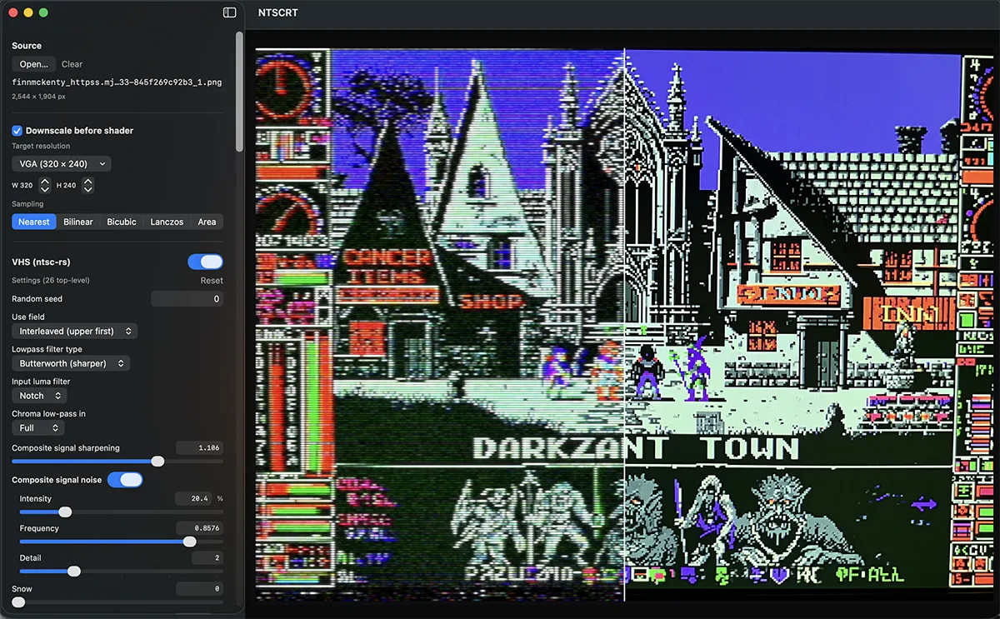

# NTSCRT



**Make any image or video look like it's playing on a 1980s TV.** NTSCRT runs your media through a real analog signal emulation ([ntsc-rs](https://github.com/ntsc-rs/ntsc-rs) — composite artifacts, tape noise, head switching) and then through RetroArch's CRT shaders (via [librashader](https://github.com/SnowflakePowered/librashader) — scanlines, phosphor masks, glow), frame-identical to RetroArch itself.

Full disclosure: **this is two much better projects hacked together.** All of the actual image magic belongs to ntsc-rs and the RetroArch shader community; NTSCRT is the native Mac interface that connects them into one pipeline:

```
your image/video → NTSC/VHS signal degradation (full res) → downscale to retro resolution → CRT shader → screen
```

## Download

Grab the DMG from [**Releases**](../../releases/latest), open it, and drag **NTSCRT** to Applications.

**Requirements:** macOS 14 or later, Apple Silicon (M1 or newer).

## Using the app

Everything lives in the left sidebar, top to bottom in pipeline order:

- **Source** — Open or drag in an image (PNG/JPEG/HEIC) or video (MP4/MOV). Videos get a frame scrubber and a ▶ play button that previews playback with all effects applied.
- **Export** — stills to PNG; videos to H.264/HEVC .mp4 or ProRes .mov (with audio) at your choice of resolution and quality. Scanline detail is brutal on lossy codecs — use the High/Very high quality tiers, or ProRes when it's headed into an edit. Exports are deterministic: same settings + same frame = same pixels.
- **Preset** — save your entire configuration (downscale + VHS + shader + view) as a JSON file and load it back later.
- **Downscale** — the retro horizontal resolution the CRT shader sees (SNES 256px, VGA 320px, or any custom width — height always follows your source's aspect ratio) and the resampling method. Nearest keeps pixels crunchy (best for pixel art), Nearest+ keeps the punch without shimmering on video, Area is the smooth neutral choice.
- **VHS (ntsc-rs)** — the analog signal stage: composite noise, chroma bleed, head switching, tracking noise, tape speed, edge wave, and about sixty more. These are ntsc-rs's own settings — preset JSON copy/pastes both ways with the [ntsc-rs desktop app](https://github.com/ntsc-rs/ntsc-rs/releases).
- **Shader** — seven RetroArch CRT presets (crt-royale, crt-hyllian, crt-aperture, crt-easymode, two crtglow variants, crtsim) with every runtime parameter exposed. Grayed-out controls tell you which switch activates them — many CRT parameters only apply when their feature (curvature, mask, geometry mode…) is on.
- **View** — **Compare** splits the preview: full pipeline on the left of the line, untouched original on the right; drag the line. **Integer scale** locks the image to whole-pixel multiples for perfectly uniform scanlines. **Animate** runs the preview continuously so tape noise, jitter, and interlacing actually move — leave it on for the real experience. Zoom with the slider (or ⌥-scroll), hold Space to pan when zoomed.

**Tips**

- Every value next to a slider is a text field — click and type exact numbers.
- The effect reads best on game-art-style content: dark scenes, bright sprites, hard edges. Photos work too, but analog artifacts live on contrast.
- High-resolution sources: turn on **Scale → Scale with video size** in the VHS panel so artifact sizes track your input, and expect the NTSC stage to take longer per frame.

## Limitations

- Official builds are **Apple Silicon**, macOS 14+. Intel Macs work when building from source (thanks to a contributed fix for discrete-GPU texture synchronization) — no prebuilt Intel binaries yet.
- The NTSC stage runs on the CPU at your source's full resolution — with **Animate** on or during video playback, 4K+ sources will noticeably drop the preview frame rate. Exports always render every frame regardless.
- Video preview playback favors correctness over speed and can run below native fps on heavy footage; the exported MP4 is full quality.
- A few crt-royale parameters are compile-time disabled in the shader itself (marked "static in this shader build") — they do nothing in RetroArch either.
- No undo — save Presets before big experiments.

## Building from source

See [DEVELOPMENT.md](DEVELOPMENT.md) for the full developer setup (Swift + Rust toolchains, vendored dependencies, CLI tools, release pipeline).

## Credits

- [ntsc-rs](https://github.com/ntsc-rs/ntsc-rs) — the NTSC/VHS signal emulation (MIT/ISC/Apache-2.0)
- [librashader](https://github.com/SnowflakePowered/librashader) by SnowflakePowered — the RetroArch-compatible shader runtime (MPL-2.0)
- [libretro/slang-shaders](https://github.com/libretro/slang-shaders) and the RetroArch community — the CRT shaders themselves: crt-royale by TroggleMonkey, crt-easymode and crt-aperture by EasyMode, crt-hyllian by Hyllian, crtsim, crtglow (various licenses, largely GPL)
