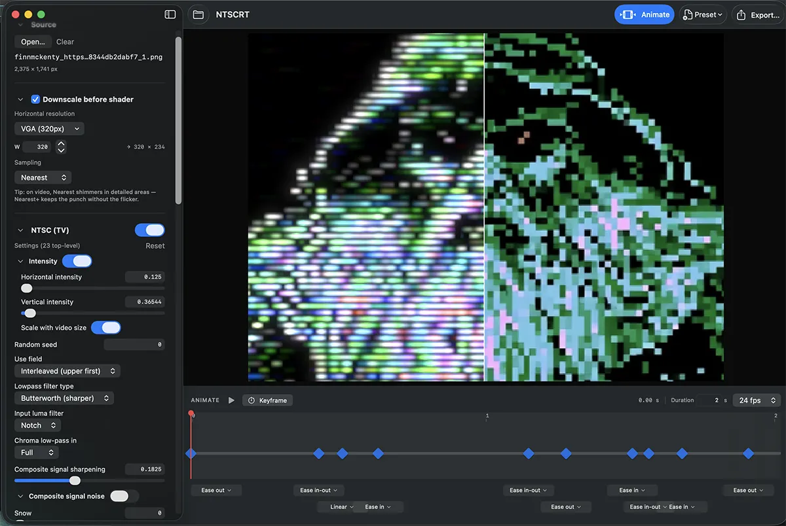

# NTSCRT



**Make any image or video look like it's playing on a 1980s TV.** NTSCRT runs your media through a real analog signal emulation ([ntsc-rs](https://github.com/ntsc-rs/ntsc-rs) — composite artifacts, tape noise, head switching) and then through RetroArch's CRT shaders (via [librashader](https://github.com/SnowflakePowered/librashader) — scanlines, phosphor masks, glow), frame-identical to RetroArch itself.

Full disclosure: **this is two much better projects hacked together.** All of the actual image magic belongs to ntsc-rs and the RetroArch shader community; NTSCRT is the native Mac interface that connects them into one pipeline:

```
your image/video → NTSC/VHS signal degradation (full res) → downscale to retro resolution → CRT shader → screen
```

## Download

Grab the DMG from [**Releases**](../../releases/latest), open it, and drag **NTSCRT** to Applications.

**Requirements:** macOS 14 or later. The app is a universal binary (Apple Silicon + Intel).

> **Intel note:** I build and test NTSCRT on Apple Silicon and haven't personally tested the Intel build. Intel support exists thanks to a contributed fix ([#1](../../pull/1)) verified by its author on an Intel iMac Pro — if something misbehaves on your Intel Mac, please open an issue.

## Using the app

**Toolbar** — file actions live in the window toolbar: **Open** (⌘O) an image (PNG/JPEG/HEIC) or video (MP4/MOV), save/load a **Preset** (your entire configuration as a JSON file — downscale, VHS, shader, view, and the whole timeline: duration, frame rate and every keyframe), or pick one of the bundled presets listed underneath — loading one that carries keyframes opens the timeline so you can see the animation it brought with it, and **Export** (⌘E): stills to PNG; videos to H.264/HEVC .mp4, ProRes .mov (with audio), or animated **GIF**, at your choice of resolution and quality. Scanline detail is brutal on lossy codecs — use the High/Very high quality tiers, or ProRes when it's headed into an edit. Exports are deterministic: same settings + same frame = same pixels. They follow the same switches as the preview: turn the **CRT** or **NTSC** section off and the export leaves that stage out too (with the CRT off you get the downscaled pixels scaled up crisp, exactly as previewed).

**Scanline banding.** CRT shaders draw scanlines in *output* pixels, so if the export height isn't a whole multiple of the downscale height, one source line covers a fractional number of rows and the scanlines group into visible bands. Exports handle this automatically — they render at a whole multiple and average down — so you can ask for any size. **Snap size to scanline grid** takes the other route: it rounds the output to the nearest size where every source line gets the same whole number of rows, which keeps scanlines at their crispest but changes your dimensions. As a rule of thumb, crisp scanlines want 3+ output rows per downscale line, so a 320px-wide downscale wants ~960px+ of output.

**Loop** repeats the content in the exported file — set it to 3 and a 6-second clip becomes an 18-second file that plays through three times. It's for places that don't loop video on playback (Instagram, say), so you don't have to open an editor just to duplicate a clip. Audio repeats with the picture. GIFs already loop forever on their own, so the field doesn't apply to them.

**GIF** gets its own width and frame rate (6/12/24/30 fps), because it doesn't behave like the video codecs: 256 colors and run-length compression versus full-frame analog noise means files run large — roughly 0.65–0.95 bytes per pixel per frame. A 5-second 480px GIF at 12 fps lands near 8 MB; at 1080px it would be 30 MB+, past what most platforms accept. The panel estimates the size before you export and warns past ~10 MB. GIF stores frame delays in hundredths of a second, so the rates land on that grid (12 fps plays at 12.5, 24 at 25, 30 at 33.3), and 60 fps isn't offered — GIF can't reliably go past 50.

**Preview** — the floating palette holds the display controls. **Compare** (split-square) divides the preview: full pipeline on the left of the line, untouched original on the right — drag the line to move the split. **Integer scale** (grid) locks the image to whole-pixel multiples for perfectly uniform scanlines. Either way the CRT pass itself always renders at a whole multiple of the downscale (at least 6 rows per line — the same supersampling exports use) and is then fitted to the window, so what you see never depends on how big the window is, and zooming in inspects the real rendered pixels. **Animate** (sparkles — the preview's own, distinct from the toolbar's timeline button) runs the preview continuously so tape noise, jitter, and interlacing actually move — leave it on for the real experience. Zoom with the slider (or ⌥-scroll), hold Space to pan when zoomed. The palette fades out when the mouse goes idle; move the mouse to bring it back. Videos get a transport bar docked under the preview — play/pause plus a full-width, frame-accurate scrubber, with all effects applied during playback.

**Animate (timeline)** — toggle **Animate** in the toolbar to keyframe-animate the entire effect chain and render it as video: scrub the playhead, dial in a look, press **Keyframe** to set one, move the playhead, dial in another look, keyframe again. Everything keys together as one master keyframe — parameters you don't change between keys hold still automatically. Click a keyframe to jump to it, and any parameter you change from there updates that keyframe in place, the way After Effects and Premiere behave. Drag a diamond to retime it, pick its interpolation from the dropdown underneath (linear, ease in, ease out, ease in-out, hold), and set the video length and frame rate in the timeline itself — export uses those. Keyframe times are proportional, so changing the duration stretches the whole animation. **Space** plays and pauses while the timeline is showing (when zoomed in, holding Space and dragging still pans). Image sources can export video even without keyframes — tape noise, jitter, and interlacing animate on their own ("VHS motion").

On a **video**, the timeline replaces the transport bar and takes its length and frame rate from the clip: the playhead *is* the video position, so scrubbing it seeks the footage and keyframes pin parameter changes to moments in the clip. Export applies the animation frame by frame.

**Screen Loop** — video feedback, the way it was made before computers: a camcorder pointed at the TV that's showing the camcorder's own picture (the BBC called it howlaround; the 1963 *Doctor Who* titles were made this way). Set up your look, then click **Screen Loop** in the toolbar. Your picture is the room the camera sees, with the TV in it; the TV shows what the camera saw a moment ago, so the picture recurses into a tunnel of copies — and every copy has been through your whole look once more than the one around it, so the noise, color bleed, moiré and tint compound the way they do in the real loop. The knobs are the camera's, and they read in words ("20% right", "10° from the left"). **Framing**: **Zoom** (each copy's size against the one around it — below 100% a tunnel, with its depth shown; above 100% the copies grow and swirl), the **vanishing point** — where the copies converge — which you drag on the preview itself (the green dot; it stays put while you change the zoom and angles, and the camera re-aims at the TV to keep it there), **Roll** (spirals), and the **side** and **vertical angle** the camera sees the screen from (steep angles at high zoom magnify the screen's near side enough to smear it outward). **Movement** — the camera in someone's hands: **Handheld** sways and trembles like a real operator, and since every copy is a trip round the loop older than the one around it, the tunnel follows the camera a moment late and snakes; the **Random seed** picks the motion, the same every time you render it. On top, a deliberate move over the render: **Drift** — pull the blue ring out of the green dot to where the vanishing point should travel, along the arrow between them (drag the arrow to move both, double-click the dot for the middle or the ring for no drift, arrow keys nudge; a faint dashed ring around the green dot shows how far Handheld wanders it) — plus **Push** in or out and **Spin**, easing from your framing — and **Seamless loop** makes the move go out and back and the shake repeat, so a GIF loops without a jump. **Camera**: **Softness**, **Screen brightness** (deep copies fade to black or burn to white), **Contrast**, **Color drift** (white balance against the TV, compounding into teal or orange), **Hue drift**, **Auto exposure** (the loop pulses). **Signal**: a **Luma key** — a video mixer keying your picture's bright parts over the camera's, so your subject stays solid while the feedback trails through the dark parts (**Key the dark parts** for dark subjects on light backgrounds) — the **Delay** (1–20 frames: each copy is that much older, so motion echoes down the tunnel; long delays exaggerate it) and a **Camcorder counter** that gets filmed along with everything else. **Presets** saves and loads the camera's settings, in a folder of their own (presets/Screen Loop) apart from the look presets. A small draft re-renders as you turn the knobs — the whole render up to 10 seconds, the same render as the final one, so it shows the same tunnel and the same moves — and **Render…** writes the full file with the Export settings, which you can change from the panel too (they're the Export button's own settings, shared): a video or GIF, from a still (for the length you choose) or from a whole clip (with its sound).

**Sidebar** — the creative pipeline, top to bottom in signal order:

- **Source** — the loaded file (drag & drop onto the panel works too).
- **Downscale** — the retro horizontal resolution the CRT shader sees (SNES 256px, VGA 320px, or any custom width — height always follows your source's aspect ratio) and how it samples: **Chunky** takes one source pixel per block for hard pixel edges (best for pixel art), **Smooth** averages the whole block — softer, and steady on detailed video.
- **NTSC (TV)** — the analog signal stage: composite noise, chroma bleed, head switching, tracking noise, tape speed, edge wave, and about sixty more. These are ntsc-rs's own settings — preset JSON copy/pastes both ways with the [ntsc-rs desktop app](https://github.com/ntsc-rs/ntsc-rs/releases).
- **Glitch** — a simulated TV receiver and VCR, for the dramatic failures: the picture rolling, tearing into diagonal bands, bending at the top, losing its color, breaking up in snow. Nothing here is drawn — the TV's sync circuits (a horizontal AFC phase-locked loop, a vertical oscillator locked by the sync pulses, the color burst gate and color killer) are simulated scan line by scan line, and the glitches are how they respond when you mistune a knob or damage the signal. So they combine the way real ones did: lower the **signal strength** and you get snow, then flickering color, then the color killer, then broken sync, in that order. **Reception** has the TV's knobs (vertical and horizontal hold, AFC response, brightness — which reveals the blanking and sync pulses) and signal faults (ghosts from reflections, mains hum); **Tape** has the VCR's (tracking error with its noise bar, head switching with the top-of-picture bend it causes, time-base jitter, tape crinkle, head clog, picture search, dropouts and the deck's dropout compensation). It's on by default with every knob healthy, and a healthy set is pixel-identical to having the section off. All of it animates on the timeline and is saved in presets. Design after Trevor Blackwell's analogtv from xscreensaver.
- **CRT** — seven RetroArch CRT presets (crt-royale, crt-hyllian, crt-aperture, crt-easymode, two crtglow variants, crtsim) with every runtime parameter exposed. Grayed-out controls tell you which switch activates them — many CRT parameters only apply when their feature (curvature, mask, geometry mode…) is on.

**Tips**

- Every value next to a slider is a text field — click and type exact numbers.
- Double-click a slider's knob to send it to where its effect is weakest — zero for strengths and amounts, 1 for brightness/contrast/saturation multipliers, flat for curvature, the default for controls that shape an effect rather than set its amount (frequencies, gammas, beam shapes).
- The effect reads best on game-art-style content: dark scenes, bright sprites, hard edges. Photos work too, but analog artifacts live on contrast.
- High-resolution sources: turn on **Intensity → Scale with video size** in the NTSC panel so artifact sizes track your input, and expect the NTSC stage to take longer per frame.

## Limitations

- The Intel half of the universal build is community-tested, not author-tested (see the note up top).
- The NTSC stage runs on the CPU at your source's full resolution — with **Animate** on or during video playback, 4K+ sources will noticeably drop the preview frame rate. Exports always render every frame regardless.
- Video playback decodes and runs the analog stage on a background pipeline and plays in real time, dropping the occasional frame when a spike hits (the NLE approach) rather than slowing down. On top of that, finished frames are kept in a RAM preview (the After Effects model): while a video sits paused the app keeps rendering ahead through the clip — the green line under the scrubber shows how far it has got — and once a loop is covered it plays with no per-frame CPU work at all, and scrubbing inside the green is instant. Any change to the NTSC, downscale or timeline settings starts it over. The cache is capped at a quarter of memory (at most 1 GB, roughly a minute of 320px-wide frames); past that the rest of the clip streams live. Exports always render every frame regardless.
- A few crt-royale parameters are compile-time disabled in the shader itself (marked "static in this shader build") — they do nothing in RetroArch either.
- No undo — save Presets before big experiments.

## Building from source

See [DEVELOPMENT.md](DEVELOPMENT.md) for the full developer setup (Swift + Rust toolchains, vendored dependencies, CLI tools, release pipeline).

## Credits

- [ntsc-rs](https://github.com/ntsc-rs/ntsc-rs) — the NTSC/VHS signal emulation (MIT/ISC/Apache-2.0)
- [librashader](https://github.com/SnowflakePowered/librashader) by SnowflakePowered — the RetroArch-compatible shader runtime (MPL-2.0)
- [analogtv](https://www.jwz.org/xscreensaver/) by Trevor Blackwell (xscreensaver) — the design the Glitch stage's receiver simulation follows: glitches as the response of simulated TV circuits
- [libretro/slang-shaders](https://github.com/libretro/slang-shaders) and the RetroArch community — the CRT shaders themselves: crt-royale by TroggleMonkey, crt-easymode and crt-aperture by EasyMode, crt-hyllian by Hyllian, crtsim, crtglow (various licenses, largely GPL)
